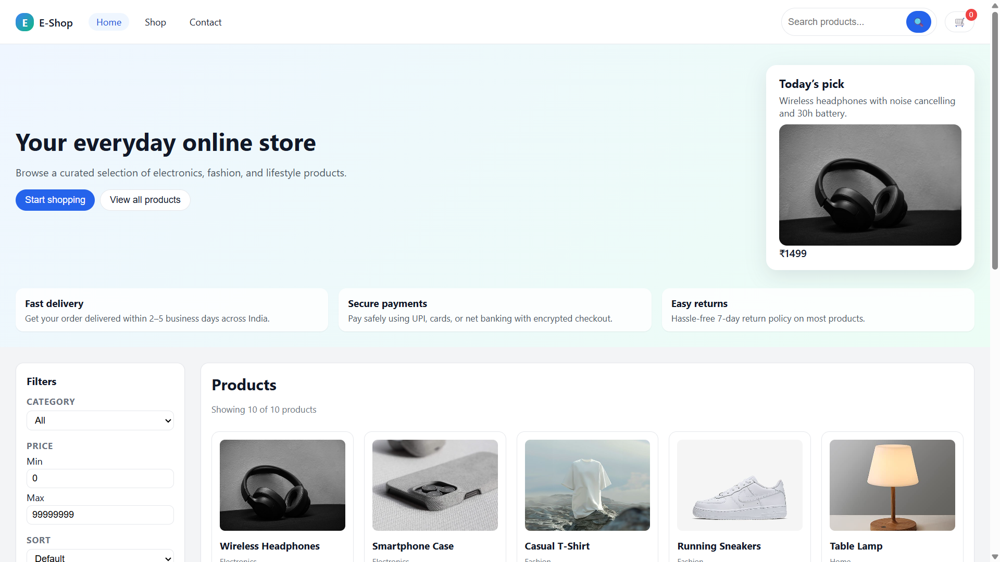
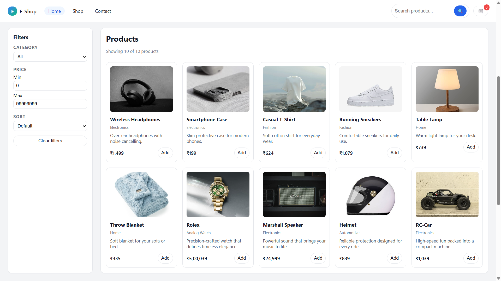
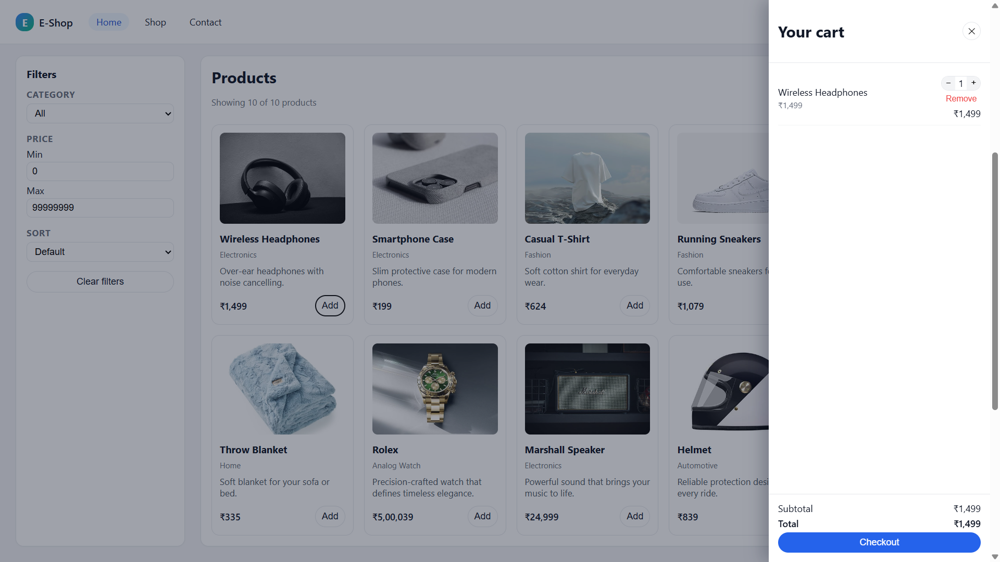
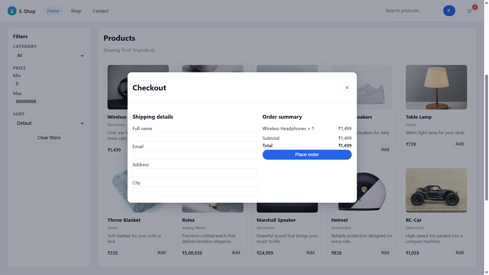

# 🛒 E-Shop — Frontend E-Commerce Web Application

E-Shop is a responsive e-commerce web application built using **HTML, CSS, and Vanilla JavaScript**.
It demonstrates how real shopping platforms work internally by implementing product browsing, filtering, cart management, and checkout functionality — all without using external frameworks.

---

## 🚀 Features

* 🛍️ Dynamic product listing
* 🔎 Live product search
* 🎯 Category-based filtering
* 💰 Price range filtering
* ↕️ Sort by price (Low → High / High → Low)
* 🛒 Add to cart / Remove from cart
* ➕ Quantity management
* 💵 Real-time subtotal and total calculation
* 📋 Checkout form with validation
* 📱 Fully responsive design (Mobile + Tablet + Desktop)
* ✉️ Contact form (demo functionality)

---

## 🧠 Concepts Demonstrated

This project showcases important frontend development skills:

* DOM Manipulation
* Event Handling
* Dynamic UI Rendering
* State Management (Cart Logic)
* Client-Side Form Validation
* Responsive Design using Flexbox & Grid
* Currency Formatting using `Intl.NumberFormat`
* Modular JavaScript Architecture
* Interactive User Experience Design

---

## 🏗️ Project Structure

```
eshop-frontend/
│
├── index.html      # Website layout and structure
├── styles.css      # Styling and responsive design
├── app.js          # Application logic (products, cart, filters)
└── images/         # Product images
```

---

## 📸 Screenshots

### 🏠 Home Page


### 🛍️ Products Section


### 🛒 Shopping Cart


### 💳 Checkout


---

## 🔮 Future Enhancements

* Save cart using LocalStorage
* Product details page
* Pagination support
* Backend integration using Spring Boot & MySQL
* User authentication (Login/Signup)
* Order history tracking

---

## 💻 Tech Stack

* HTML5
* CSS3
* JavaScript (ES6)
* Responsive Layout (Flexbox + Grid)

---

## 🎯 Purpose of This Project

This project was developed as part of my learning journey in **Java Full Stack Development** to understand how frontend e-commerce systems function before integrating backend services.

---

## 👩‍💻 Author

**Rajkumar**
Java Full Stack Developer

---

## 📄 License

This project is created for educational and demonstration purposes.
